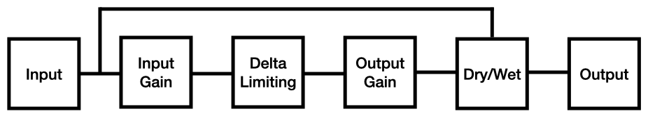

# User Manual: Delta Limiter

*Author: Hannes Braun*

*Version: 2.2*

## About

This plugin is a clipper in its core. A more fitting name would probably be "Delta Clipper". But it does not clip the signal directly. Instead, it's clipping the first derivate of the signal. Additionally to the usual clipping artifacts, this also results in some kind of lowpassing behaviour. Try it out yourself.

## Usage

### Input Gain

This control applies gain to the input signal. You may want to increase this value if your signal is too quiet to get distorted. You probably want to turn it down, when your input signal is too loud. Turning the input gain up results in the same effect (regarding the distortion) as turning the Delta Limit down. Use those two controls hand-in-hand.

### Delta Limit

This control defines how big the absolute difference between two samples can be at maximum. To avoid a DC offset, there is a tiny fadeout when approaching a value of zero.

### Output Gain and Dry/Wet

These two controls should be quite straight forward. Use the output gain to correct the signal level after the distortion. The Dry/Wet control allows you to layer the distorted signal with the clean signal.

### Signal Flow

Below, you can find a simple visualization of the signal flow.

